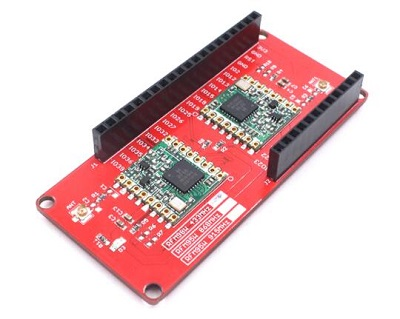
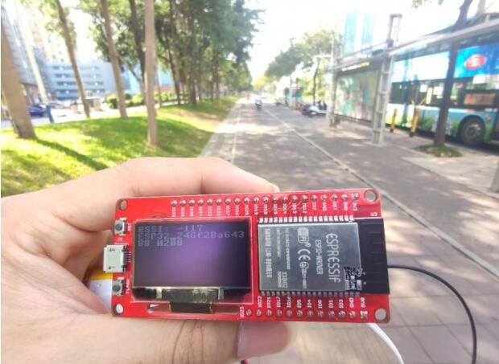
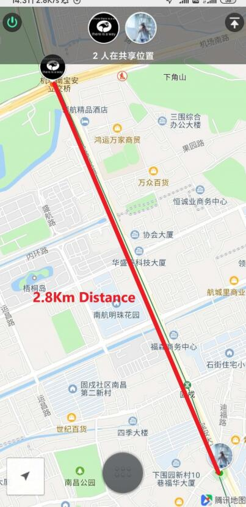

# MakePython Lora

```c++
/*
Version:		V2.1
Author:			Vincent
Create Date:	2020/7/24
Note:
2021/8/18		V2.1 Fix Lora Gateway 915M bug.
2020/12/11		V2.0 Now supply arduino lib: RadioLib
*/
```

[toc]

# Introduce

The Makepython Lora transceivers feature the LoRaTM long range modem that provides ultra-long range spread spectrum communication and high interference immunity whilst minimising current consumption.



- You can get one from: [MakePython Lora](https://www.makerfabs.com/esp32-lora-gateway.html)
- Hardware and detailed instructions please visit Wiki page:  [MakePython Lora Wiki](https://www.makerfabs.com/wiki/index.php?title=MakePython_Lora)
- Note that you need solder four 0Ω±5% 0603 resistors at R6,R7,R9,R10 when using RadioLib(RadioLib library requires)

# Related Tests

- Long distance Lora communication





# Related Projects

## [Project_IoT Irrigation System](https://github.com/Makerfabs/Project_IoT-Irrigation-System)

- IoT agricultural irrigation experiment based on Lora communication.
- [YOUTUBE:Lora IoT Irrigation System - Outdoor Simulation Test](https://youtu.be/0mY6Ox0YvRk)


