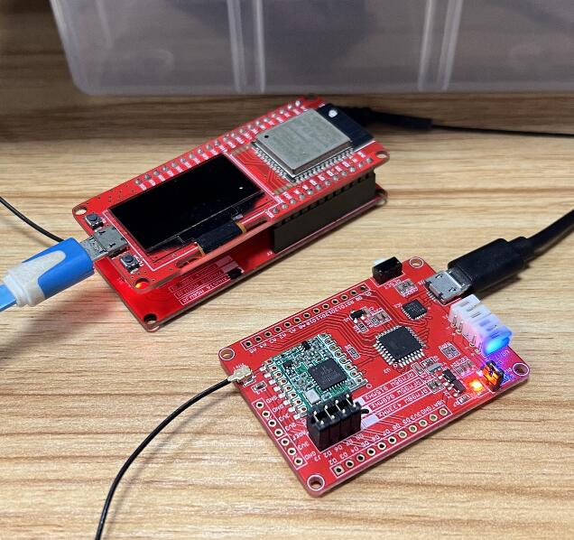

# MakePython Lora

```c++
/*
Version:		V2.1
Author:			Vincent
Create Date:	2020/7/24
Note:
2021/8/18		V2.1 Fix Lora Gateway 915M bug.
2020/12/11		V2.0 Now supply arduino lib: RadioLib
2022/8/15		V2.1 Update new RadioLib demo
*/
```

[toc]


# Makerfabs

[Makerfabs home page](https://www.makerfabs.com/)

[Makerfabs Wiki](https://wiki.makerfabs.com/)


# Introduce

The Makepython Lora transceivers feature the LoRaTM long range modem that provides ultra-long range spread spectrum communication and high interference immunity whilst minimising current consumption.

Product Link ： [MakePython Lora](https://www.makerfabs.com/esp32-lora-gateway.html)

Wiki Link : [MakePython Lora Wiki](https://wiki.makerfabs.com/MaESP_ESP32_Lora_Gateway.html)

## Front


# RadioLib Example

## send_and_receive.ino

A demo for communicating with the standard Makerfabs LoraNode (MaLora).

All Lora Nodes use this Lora library: [RadioLib](https://github.com/jgromes/RadioLib)

**It is recommended to install from Arduino Library Manager and select the library version 4.6.0. RadioLib libraries after 5.0 need to add "RADIOLIB_" before some macro definitions.**

The current firmware is developed in RadioLib 4.6.0.

## MaLora

**MaLora** is Makerfabs Loranode.

Makerfabs Lora Node is a series of products based on Arduino Pro Mini (328P) + Lora(SX127X). 

Like Relay, AC Dimmer, MOSFET, etc.

For easy to use, UID and generic instructions are provided. Some of them are our previous products, but have not added UID yet. 

[MaLora](https://github.com/Makerfabs/Makerfabs_MaLora)

*We started with MicroPython, but the Lora library support was not good. There was also a failure to communicate with other Lora libraries. So we discontinued MicroPython maintenance, and subsequent Makerfabs Lora-related products use the agreed Lora library.*

## Test



Communicates with a standard Lora Node. The code used by Maduino Lora Radio is in:

 [LoraNodeDemo](https://github.com/Makerfabs/Makerfabs_MaLora/tree/main/MaduinoLoraRadio/firmware/LoraNodeDemo)

Serial Monitor Display:


# Related Tests

- Long distance Lora communication


# Related Projects

## [Project_IoT Irrigation System](https://github.com/Makerfabs/Project_IoT-Irrigation-System)

- IoT agricultural irrigation experiment based on Lora communication.
- [YOUTUBE:Lora IoT Irrigation System - Outdoor Simulation Test](https://youtu.be/0mY6Ox0YvRk)


